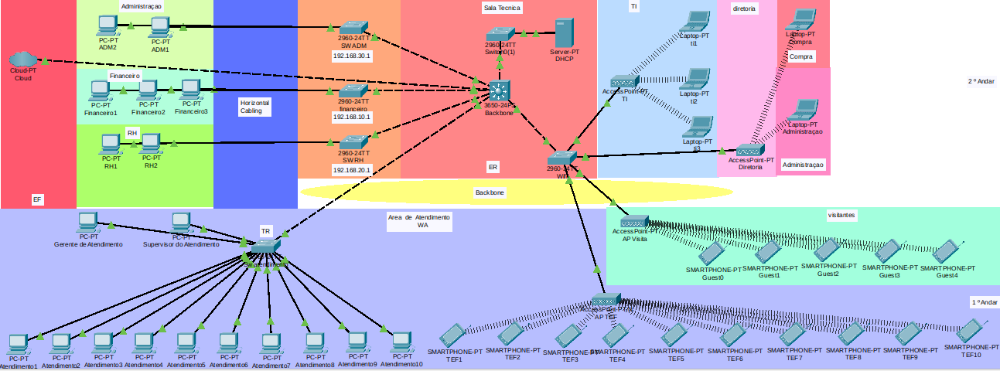

# 📡 Atendimento Ágil Ltda – Corporate Network Infrastructure

## 📌 Overview

This project presents the complete design and implementation of a corporate network infrastructure using Cisco Packet Tracer.

The topology simulates a real-world enterprise environment distributed across two floors, implementing VLAN segmentation, inter-VLAN routing, centralized DHCP services, and wireless network separation for internal staff and visitors.

The architecture follows a hierarchical network model (Core and Access layers), ensuring scalability, organization, and logical isolation between departments.

---

## 🏢 Physical Structure

The company is divided into two floors:

### 🔹 First Floor
- Customer Service Department (10 workstations)
- Customer Service Manager
- Supervisor
- Wi-Fi network for IT team
- Guest Wi-Fi network

### 🔹 Second Floor
- Administration
- Finance
- Human Resources (HR)
- IT Department
- Executive Board (Diretoria)
- Technical Room (Backbone/Core)
- Dedicated DHCP Server

---

## 🧠 Network Architecture

The network follows a hierarchical model:

### 🔸 Core Layer
- Cisco 3560 Layer 3 Switch
- Responsible for:
  - Inter-VLAN Routing
  - Default Gateway for VLANs
  - Backbone aggregation

### 🔸 Access Layer
- Cisco 2960 Switches
- Department-based segmentation
- End-device connectivity

---

## 🌐 VLAN Segmentation

Each department is logically separated using VLANs to:

- Reduce broadcast domains
- Improve security
- Optimize traffic management
- Allow scalable expansion

### Example Network Addressing

| VLAN | Department      | Network           |
|------|------------------|------------------|
| 10   | Administration   | 192.168.10.0/24  |
| 20   | Finance          | 192.168.20.0/24  |
| 30   | HR               | 192.168.30.0/24  |
| ...  | Others           | Structured per sector |

Inter-VLAN routing is performed by the Layer 3 switch.

---

## 📶 Wireless Infrastructure

Three wireless networks were implemented:

- 🔐 Executive Wi-Fi
- 👨‍💻 IT Wi-Fi
- 🌍 Guest Wi-Fi (logically isolated)

This ensures traffic separation between internal users and visitors.

---

## 🖥 Implemented Services

- ✅ Centralized DHCP Server
- ✅ Inter-VLAN Routing
- ✅ Hierarchical Topology
- ✅ Internet Connectivity (Cloud Simulation)
- ✅ Multi-floor structured deployment

---

## 🔒 Security Considerations

The design includes logical separation via VLANs.  
Future improvements may include:

- ACL implementation
- Port Security
- DHCP Snooping
- Dedicated Firewall
- Redundant Core Layer

---

## 🚀 Technical Objectives Achieved

- Enterprise-grade VLAN segmentation
- Layer 3 routing configuration
- Centralized IP address management
- Structured physical and logical topology
- Wireless access control separation
- Scalable backbone infrastructure

---

## 🛠 Technologies Used

- Cisco Packet Tracer
- Cisco 3560 (Layer 3 Switch)
- Cisco 2960 (Access Switch)
- DHCP Server
- Wireless Access Points
- VLAN & Inter-VLAN Routing

---

## 📈 Future Improvements

- High availability (redundant core)
- Link aggregation (EtherChannel)
- Advanced security policies (ACL filtering)
- Network monitoring implementation

---

## 👨‍💻 Author

Luiz  
Network & Cybersecurity Enthusiast  
Focused on Infrastructure, Ethical Hacking and Enterprise Networking
